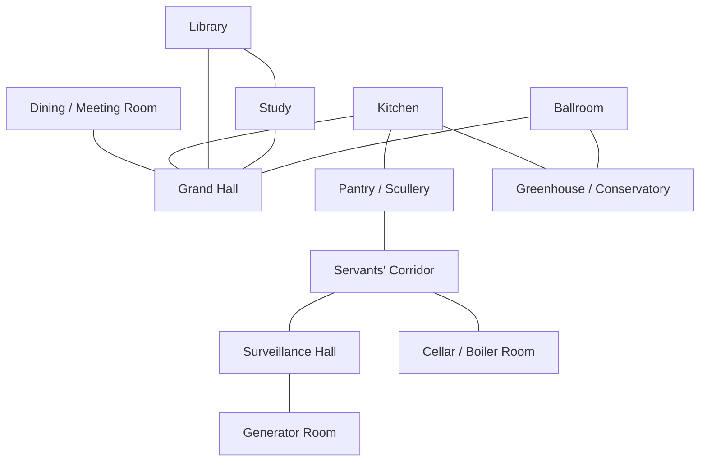

# Floorplan From Concept

Reference asset: [`blackout-manor-concept-v1.png`](./reference/blackout-manor-concept-v1.png)

This document turns the concept image into a playable manor blockout for Milestone 6B. It is not a literal tracing. It is the implementation target for connected-house readability, pathing, and meeting staging.

## Room Adjacency Graph

## Central Hall Geometry
- `Grand Hall` is the central double-height anchor of the whole house.
- Target shape: broad rectangle, wider than tall, with a central floor medallion and two visible upper-side landings.
- The hall should expose at least four obvious exit vectors in whole-manor mode:
  - west toward `Dining / Meeting Room`
  - southwest toward `Kitchen`
  - east toward `Library` and `Study`
  - southeast toward `Ballroom`
- The hall is the default orientation room for both overview camera and event recentering.

## Approximate Room Proportions

| Room | Target Relative Size | Shape Bias | Why |
| --- | --- | --- | --- |
| Grand Hall | very large | broad rectangle | main overview anchor and crossing space |
| Dining / Meeting Room | large | horizontal rectangle | 10-seat table, gathering lanes |
| Kitchen | medium-large | work triangle rectangle | dense but readable service activity |
| Pantry / Scullery | small-medium | narrow annex | visible support route and storage logic |
| Library | large | horizontal rectangle | shelves, fireplace, desk cluster |
| Study | medium | compact rectangle | suspicion-heavy private-feeling room |
| Ballroom | large | open rectangle | clear social stage and visible bodies |
| Greenhouse / Conservatory | medium-large | long glass annex | high atmosphere, visible planter lanes |
| Surveillance Hall | medium | control-room rectangle | cold technical contrast |
| Generator Room | medium | machine room rectangle | industrial hazard clarity |
| Servants' Corridor | long narrow | corridor bar | legible back-of-house route |
| Cellar / Boiler Room | medium-large | low heavy rectangle | pipe and boiler staging |

## Corridor Layout
- Front-of-house circulation is centered on `Grand Hall`.
- A visible west-side service loop links `Kitchen`, `Pantry / Scullery`, and `Servants' Corridor`.
- The technical lower band links `Servants' Corridor`, `Surveillance Hall`, `Generator Room`, and `Cellar / Boiler Room`.
- `Ballroom` acts as the social south-east anchor, while `Greenhouse / Conservatory` is a south-west or south annex that visually cools the palette and breaks the wood-and-stone rhythm.
- `Library` and `Study` form an east-side knowledge cluster; the player should read them as related spaces even if each keeps its own threshold.

## Threshold And Doorway Placement
- `Grand Hall` to `Dining / Meeting Room`: wide double-door threshold for visible gathering.
- `Grand Hall` to `Kitchen`: single or service double door, visibly simpler than the dining threshold.
- `Grand Hall` to `Library`: wide arched opening or double door for overview readability.
- `Grand Hall` to `Study`: narrower, more private-feeling threshold than the library entrance.
- `Grand Hall` to `Ballroom`: broad social threshold with a sense of stage access.
- `Kitchen` to `Pantry / Scullery`: tight service door with short visual connection.
- `Pantry / Scullery` to `Servants' Corridor`: obvious service passage.
- `Servants' Corridor` to `Surveillance Hall` and `Generator Room`: direct industrial doors.
- `Servants' Corridor` to `Cellar / Boiler Room`: stair or ramp threshold, not flat same-plane magic travel.
- `Kitchen` to `Greenhouse / Conservatory`: side or rear annex threshold with a cooler light spill.
- `Library` to `Study`: optional internal connecting door to support readable evidence flow.
- `Ballroom` to `Greenhouse / Conservatory`: optional cross-connection for cinematic social movement, not required for core navigation.

## Dining / Meeting Room Seating Geometry For 10 Agents
- Long table centered in the room.
- Four seats on the west side.
- Four seats on the east side.
- One chair at the north head.
- One chair at the south foot.
- Minimum aisle requirements:
  - enough width behind side chairs for avatars to take seats without overlap
  - one clear approach lane from the main doorway
  - one clear camera lane for vote and exile presentation

## Whole-Manor Mode Visibility
Whole-manor mode should clearly expose:
- the `Grand Hall` floor and exits
- the full `Dining / Meeting Room` table shape
- at least one obvious task edge in `Kitchen`, `Study`, `Surveillance Hall`, and `Generator Room`
- the open central floor of the `Ballroom`
- the greenhouse glazing and planter geometry
- the technical lower band as a continuous service route

Whole-manor mode may compress:
- pantry storage detail
- back-wall shelf density in `Library`
- secondary clutter in `Cellar / Boiler Room`

## Room-Focus Mode Clarity
Room-focus mode should make these things clearer:
- exact doorway edges and character entrances
- task-side approach lanes
- accusation and reassurance spacing between avatars
- dining chair occupation and absences during meetings
- which prop cluster is the active hotspot
- sabotage state changes in `Generator Room`, `Surveillance Hall`, `Cellar / Boiler Room`, and `Greenhouse / Conservatory`

## Implementation Notes
- The concept image suggests a two-tier manor composition, but the runtime blockout should privilege readability over literal illustration.
- If a room must move slightly to preserve clearer routes, keep the concept's hierarchy rather than its exact coordinates.
- The finished floorplan should still feel like one house when viewed from `/game/demo` at a glance.
