# Orchestration Graph

This is the target presentation orchestration graph for the Embodied Spectator Overhaul. It adapts the current runtime architecture rather than replacing it.

```mermaid
graph TD
    A["Launcher (/)"] --> B["Spectator Runtime (/game/[roomId])"]
    B --> C["Game Director"]
    C --> D["Camera Director"]
    C --> E["Phase / Meeting Director"]
    C --> F["Replay Director"]
    C --> G["Surveillance Director"]
    B --> H["Room Focus / Zoom Mode"]
    B --> I["Event Board"]
    B --> J["Sound Bus"]

    K["Agent Simulation"] --> L["Public Event Bus"]
    L --> M["Movement Planner"]
    M --> M1["Room Graph"]
    M --> M2["Door Nodes"]
    M --> M3["Corridor Paths"]
    M --> M4["Hotspot Targets"]
    L --> N["Avatar State Mapper"]
    N --> N1["Walk Cycle"]
    N --> N2["Posture"]
    N --> N3["Action Badge"]
    N --> N4["Speech Bubble"]
    L --> O["Task Animation Layer"]
    L --> P["Meeting Seating Layer"]

    Q["Art Stack"] --> Q1["Floorplan Tiles"]
    Q["Art Stack"] --> Q2["Room Props"]
    Q["Art Stack"] --> Q3["Character Sheets"]
    Q["Art Stack"] --> Q4["Portraits"]
    Q["Art Stack"] --> Q5["UI Pack"]
    Q["Art Stack"] --> Q6["Audio Pack"]
    Q6 --> R["Asset Manifest"]
    R --> R1["Phaser Loader"]
    R --> R2["Runtime Theme"]
    R --> R3["Credits / Licenses"]

    S["Replay / EQ"] --> T["Replay Runtime"]
    S --> U["Dev Fairness Route"]
    S --> V["EQ Analytics"]
```

## Adaptation Notes
- `Game Director`, `Camera Director`, `Meeting Director`, `Replay Director`, and `Surveillance Director` align with the existing world-first runtime.
- `Public Event Bus` means authoritative public state and replay/public event flow, not private cognition.
- `Movement Planner`, `Meeting Seating Layer`, and `Task Animation Layer` are presentation/runtime responsibilities only.
- `Asset Manifest` stays the gate for all imported art and audio.
- `Dev Fairness Route` and `EQ Analytics` remain outside the live route.
